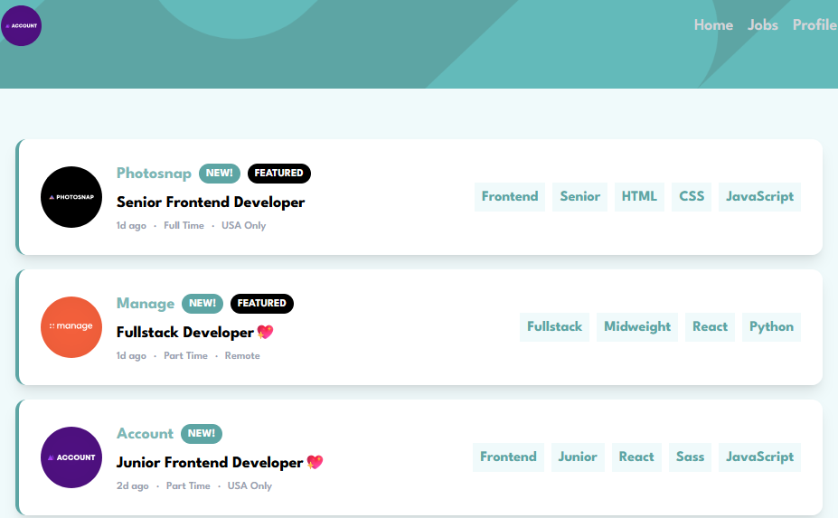

# Frontend Mentor - Job listings with filtering solution

This is a solution to the [Job listings with filtering challenge on Frontend Mentor](https://www.frontendmentor.io/challenges/job-listings-with-filtering-ivstIPCt). Frontend Mentor challenges help you improve your coding skills by building realistic projects.

## Table of contents

- [Overview](#overview)
  - [The challenge](#the-challenge)
  - [Screenshot](#screenshot)
  - [Links](#links)
- [My process](#my-process)
  - [Built with](#built-with)
  - [What I learned](#what-i-learned)
- [Author](#author)

**Note: Delete this note and update the table of contents based on what sections you keep.**

## Overview

### The challenge

Users should be able to:

- View the optimal layout for the site depending on their device's screen size
- See hover states for all interactive elements on the page
- Filter job listings based on the categories

Extra features:

- Users can favorite jobs
- Favorited jobs appear in the Profile page and persist between reloads.

### Screenshot



### Links

- Solution URL: [Add solution URL here](https://www.frontendmentor.io/challenges/job-listings-with-filtering-ivstIPCt)
- Live Site URL: [Add live site URL here](https://job-listings-chi-ten.vercel.app/jobs)

## My process

### Built with

- [React](https://reactjs.org/) - JS library
- [Next.js](https://nextjs.org/) - React framework
- [Redux](https://redux.js.org/) - State management
- Tailwind CSS

### What I learned

## NextJS:

- app folder is only for routes
- SSR Server Side Rendering: a new page is rendered from scratch for every request.
- SSG Static Site Generation: the page is pre rendered ahead of time and the same file is sent to everyone per request.
- RSC React Server Components: the server helps make the page faster by doing some of the work before sending it to your browser.
- SPA Single Page Application: the entire app lives inside one document but parts of the document may be updated with individual requests.

## Tailwind:

- add 'hover' to parent div to flag container as hover target, then add group-hover:_effect_ to a specific part so only it gets affected

## Redux:

- A store is an object that holds the whole state tree of the application. The only way to change the state inside it is to dispatch an action on it, which triggers the root reducer function to calculate the new state.

- Use configureStore to create the store.

```js
export const store = configureStore({
  reducer: {
    filters: filtersReducer, // filters is key in global state obj
  },
});
```

- Use createSlice to create the functionality (reducers) for the store.

```js
const filtersSlice = createSlice({
  name: "filters",
  initialState,
  reducers: {
    // can safely use .push() to mutate state (redux uses Immer)
    // Action to add a tag to state array
    addTag: (state, action: PayloadAction<string>) => {
      if (!state.selectedFilters.includes(action.payload))
        state.selectedFilters.push(action.payload);
    },
  }
})
```

- Use dispatch() to make use of the defined reducers.

```js
const dispatch = useDispatch();
dispatch(addTag(tag));
```

- Use

```js
console.log(store.getState());
```

to check the state.

### Redux Persist

- Used as an alternative to native localStorage.
- Wrapped main from Provider inside PersistGate in order to not load empty data and wait for it to arrive from localStorage.

### Motion

- Used for animating React components (can't be done with just tailwind, because React removes that component from the DOM immediately) ==> detects when children are removed but lets them play their exit animation first.
- motion gives normal HTML elements animation capabilities.
- AnimatePresence handles elements that React is about to remove from the DOM, children must have individual keys.

## Author

- Frontend Mentor - [@Cloudiu9](https://www.frontendmentor.io/profile/Cloudiu9)
- LinkedIn - [@Claudiu](https://www.linkedin.com/in/claudiu-bordea/)
